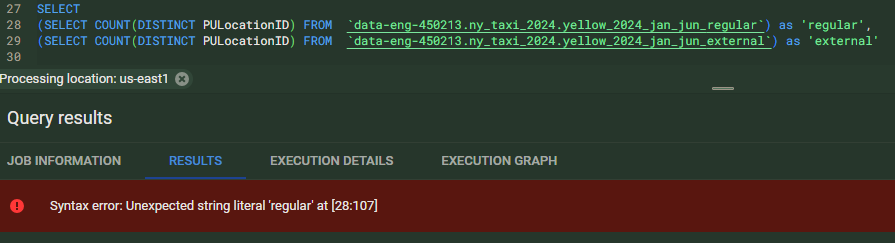

## BigQuery

### External Table vs Native Table;  

When data is stored outside Bigquery, google drive or gcp bucket or somewhere else, we create an external table.  
The other way is to [load the data into BigQuery](https://cloud.google.com/bigquery/loading-data), if query speed is priority.
> External tables don't support clustering. They support partitioning in limited ways. For details, see Querying externally partitioned data. When you query an external data source other than Cloud Storage, the results are not cached.
[how-to make external table:](https://cloud.google.com/bigquery/docs/external-data-cloud-storage?_gl=1*c38p3w*_ga*Nzk0MDgzNTY0LjE3Mzk0MTA1Mjc.*_ga_WH2QY8WWF5*MTczOTQyMTc2MS4zLjEuMTczOTQyMjgzMi42MC4wLjA.#create-external-table)  
1. Use the Bigquery UI
2. Use python sciprt
3. sql script.
Note: make sure the gcp bucket's location and Bigquery's location is the same region(settings). This error similar to 'source and destination region do not match' will throw.
how-to: enable cache metadata for external table? this is applicable only for BigTable's external table

- Column aliases in bigquery: no need to put 'quotes':  
SELECT 
(SELECT COUNT(DISTINCT PULocationID) FROM  `table1`) as regular,
(SELECT COUNT(DISTINCT PULocationID) FROM  `table2`) as external

- typing 'regular' and 'external' will throw error:  

 

